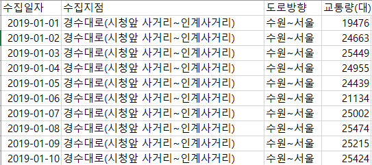

# 데이터 분석 & 시각화

---

# 1. 데이터 분석 주제

### 주제 : 평균 기온, 강수량에 의한 교통량 변화 측정

### 주제 선정 이유

- 교통량은 다양한 변수들에 의해 크게 바뀐다. 일반적으로 생각하면 눈이 오는 날은 교통량이 적을 것이고, 명절이나 공휴일은 교통량이 증가할 것이다. 그렇다면 과연 기온과 강수량은 교통량에 유의미한 변화를 주는 지를 알아본다.

# 2. 데이터 파일 정보

### 분석 데이터 정보

1. **수원시 도로 교통량**
    - 2019/01/01 ~ 2019/12/31 기간의 경수대로, 덕영대로, 중부대로 상하행선 교통량 측정 데이터
    - 데이터 수 : 2142개
    - 출처 : 공공데이터포털([https://www.data.go.kr/data/15080202/fileData.do](https://www.data.go.kr/data/15080202/fileData.do))
    - csv 파일 구성요소
    
    | 수집일자 | 교통량이 수집 된 날짜. 2019/01/01~2019/12/31 로 구성 |
    | --- | --- |
    | 수집지점 | 경수대로, 덕영대로, 중부대로 |
    | 도로방향 | 상/하행선 구분 |
    | 교통량 | 하루동안의 수집지점의 교통량의 수 |




1. **수원시 평균 온도**
    - 수원시 2019년도 평균 기온 데이터
    - 데이터 수 : 12개
    - 출처 : 기상청 기상자료개방포털([https://data.kma.go.kr/data/grnd/selectAsosRltmList.do?pgmNo=36](https://data.kma.go.kr/data/grnd/selectAsosRltmList.do?pgmNo=36))
    - csv 파일 구성요소
    
    | 지점명 | 수원 |
    | --- | --- |
    | 일시 | 2019년 1월~12월 |
    | 평균기온(°C) | 월별 기온 평균값 |
    | 평균최고기온(°C) | 월별 최고기운 평균값 |
    | 평균최저기온(°C) | 월별 최저기운 평균값 |
    
    
    
2. **수원시 평균 강수량**
    - 수원시 2019년도 평균 강수량 데이터
    - 데이터 수 : 12개
    - 출처 : 기상청 기상자료개방포털([https://data.kma.go.kr/data/grnd/selectAsosRltmList.do?pgmNo=36](https://data.kma.go.kr/data/grnd/selectAsosRltmList.do?pgmNo=36))
    - csv 파일 구성요소
    
    | 지점명 | 수원 |
    | --- | --- |
    | 일시 | 2019년 1월~12월 |
    | 월합강수량(mm) | 월별 강수량 합 |
    | 일최다강수량(mm) | 월별 하루 최다강수량 |
    
    
    

# 3. 결과 데이터

- **2019년 월별 교통량, 평균온도, 월강수량 데이터로 추출**
- **데이터 수 : 36개**

```sql
<SQL 코드>
SET HEADING ON   -- 헤더 ON
SET PAGESIZE 100 -- 한페이지에 표시할 레코드 수
SET TERM OFF     -- 조회결과 표시 OFF
SET COLSEP ','   -- 데이터 구분자
SET FEEDBACK OFF -- 결과의 데이터건수, 시간표시 OFF

SPOOL C:\SQLDEV\TEST1.CSV  -- 저장할 CSV 파일 이름, 위치 설정
SELECT TO_CHAR(T.MDATE, 'YYYY/MM/DD') AS "년/월"
     , T.REGION AS 지역
     , TRA.지점
     , TRA.교통량
     , T.AVGTEMPERATURE AS 평균온도
     , P.MONPRECIPITATION AS 월강수량
  FROM TEMPERATURE T
 INNER JOIN PRECIPITATION P
    ON T.MDATE = P.MDATE
  LEFT OUTER JOIN (SELECT TO_CHAR(COLDATE, 'YY/MM') AS 년월
                        , COLPOINT AS 지점
                        , SUM(VOLTRAFFIC) AS 교통량
                     FROM TRAFFIC
                    GROUP BY TO_CHAR(COLDATE, 'YY/MM'), COLPOINT
                    ORDER BY TO_CHAR(COLDATE, 'YY/MM') ASC, COLPOINT DESC) TRA
    ON TO_CHAR(P.MDATE, 'YY/MM') = TRA.년월
 ORDER BY TRA.지점 ASC;
SPOOL OFF
```


# 4. 데이터 시각화 & 결론

### 데이터 시각화

- **Excel를 이용한 시각화**


- **Java를 이용한 시각화**

```jsx
<%@ page language="java" contentType="text/html; charset=UTF-8"
	pageEncoding="UTF-8"%>
<!DOCTYPE html>
<html>
<head>
<meta charset="UTF-8">
<title>Insert title here</title>
    <!--Load the AJAX API-->
    <script type="text/javascript" src="https://www.gstatic.com/charts/loader.js"></script>
</head>
<body>
	<%@ page import="java.sql.*"%>
	<h2>Column Chart Example</h2>

	<!--Div that will hold the pie chart-->
	<div id="columnchart_values"></div>

    <script type="text/javascript">
    google.charts.load("current", {packages:['corechart']});
    google.charts.setOnLoadCallback(drawChart);
		   
		function drawChart() {
		         
	         var arr = new Array();
	         arr.push(['Element', 'Density', { role: 'style' }]);
		    
	        <%
			try{
			       String driverName = "oracle.jdbc.driver.OracleDriver";
			       String dbURL="jdbc:oracle:thin:@192.168.119.119:1521:dink";
			
			       Class.forName(driverName);
			       Connection conn = DriverManager.getConnection(dbURL,"scott","tiger");
			
			       Statement stmt = conn.createStatement();
			       String sql = "SELECT TO_CHAR(T.MDATE, 'YYYY/MM/DD') AS 년월, T.REGION AS 지역, TRA.지점, TRA.교통량, T.AVGTEMPERATURE AS 평균온도, P.MONPRECIPITATION AS 월강수량 FROM TEMPERATURE T INNER JOIN PRECIPITATION P ON T.MDATE = P.MDATE LEFT OUTER JOIN (SELECT TO_CHAR(COLDATE, 'YY/MM') AS 년월, COLPOINT AS 지점, SUM(VOLTRAFFIC) AS 교통량 FROM TRAFFIC GROUP BY TO_CHAR(COLDATE, 'YY/MM'), COLPOINT ORDER BY TO_CHAR(COLDATE, 'YY/MM') ASC, COLPOINT DESC) TRA ON TO_CHAR(P.MDATE, 'YY/MM') = TRA.년월 WHERE TRA.지점 LIKE '경수%' ORDER BY TRA.지점 ASC";
			       ResultSet rs = stmt.executeQuery(sql);
			       
			       int i = 0;
			       while(rs.next()) {
				   int traffic=rs.getInt("교통량");
				   double avgTem=rs.getDouble("평균온도");
					 // 월강수량-교통량그래프로나타내기
					 // int traffic=rs.getInt("교통량");
				   // double monPre=rs.getDouble("월강수량");          	
				%>
					arr.push(['<%=avgTem%>', <%=traffic%>, 'gold']);
					// arr.push(['<%=monPre%>', <%=traffic%>, 'gold']);
			<%
			  }
		         if(rs != null) rs.close();
		         if(stmt != null)stmt.close();
		         if(conn != null)conn.close();
		
		         conn.close();
		
		   }catch(Exception e){
				out.println(e);
		   }
		  %>
		 console.log(arr);
		  // Create the data table.
			var data = google.visualization.arrayToDataTable(arr);
			var view = new google.visualization.DataView(data);
		      view.setColumns([0, 1,
		                       { calc: "stringify",
		                         sourceColumn: 1,
		                         type: "string",
		                         role: "annotation" },
		                       2]);
		      var options = {
		    	        title: "평균온도-교통량그래프",
									// title: "월강수량-교통량그래프",
		    	        width: 1200,
		    	        height: 800,
		    	        bar: {groupWidth: "95%"},
		    	        legend: { position: "none" },
		    	      };
		      
		  // Set chart options
		      var chart = new google.visualization.ColumnChart(document.getElementById("columnchart_values"));
		      chart.draw(view, options);
		}
    </script>
</body>
</html>

```


- **R을 이용한 시각화**

```r
# 시각화를 위한 패키지 ggplot2
library(ggplot2)

# data에 쿼리 결과 저장
data <- dbGetQuery(conn, "SELECT TO_CHAR(T.MDATE, 'YYYY/MM/DD') AS 년월
                      , T.REGION AS 지역
                      , TRA.지점
                      , TRA.교통량
                      , T.AVGTEMPERATURE AS 평균온도
                      , P.MONPRECIPITATION AS 월강수량
                      FROM TEMPERATURE T
                      INNER JOIN PRECIPITATION P
                      ON T.MDATE = P.MDATE
                      LEFT OUTER JOIN (SELECT TO_CHAR(COLDATE, 'YY/MM') AS 년월
                                       , COLPOINT AS 지점
                                       , SUM(VOLTRAFFIC) AS 교통량
                                       FROM TRAFFIC
                                       GROUP BY TO_CHAR(COLDATE, 'YY/MM'), COLPOINT
                                       ORDER BY TO_CHAR(COLDATE, 'YY/MM') ASC, COLPOINT DESC) TRA
                      ON TO_CHAR(P.MDATE, 'YY/MM') = TRA.년월
                      WHERE TRA.지점 LIKE '경수%'  # 경수대로 데이터만 출력
                      ORDER BY TRA.지점 ASC")

# 평균온도 - 교통량 막대그래프
ggplot(data, aes(x=평균온도, y=교통량))+geom_bar(stat="identity", width = .4)
# 월강수량 - 교통량 막대그래프
ggplot(data, aes(x=월강수량, y=교통량))+geom_bar(stat="identity", width = 3)  
```


### 결론 및 의견

- **교통량과 평균기온의 상관관계**
    - 아래의 그림에 표시된 부분을 보면 평균 기온이 24도 차이가 남에도 불구하고 교통량은 유의미한 차이를 보여주지 못한다.


- **교통량과 강수량의 상관관계**
    - 아래의 그림을 보면 강수량이 차이가 큰 여름과 겨울을 비교했음에도 불구하고 교통량에는 크게 유의미한 차이를 보여주지 못한다.
        
        
        

- **결론 및 의견**
    - 위의 두 데이터를 보면 평균기온과 강수량은 교통량과 크게 상관이 없음을 알 수 있다. 시각화한 데이터를 보면 교통량은 겨울이 될수록 줄어들고 봄부터 점차 증가함을 볼 수 있다.
    - 이와 같은 데이터를 통하여 가설을 두 가지 생각해 볼 수 있는데, 첫 번째 가설은 여행이 비교적 적은 겨울철에는 교통량이 적고 날씨가 풀리는 4월부터는 점차 여행을 떠나는 인구가 많아져 교통량에 변화를 줄 수 있다. 두 번째 가설은 1~3월의 경우 눈이 내리기 때문에 교통량이 줄어들 수 있다.
